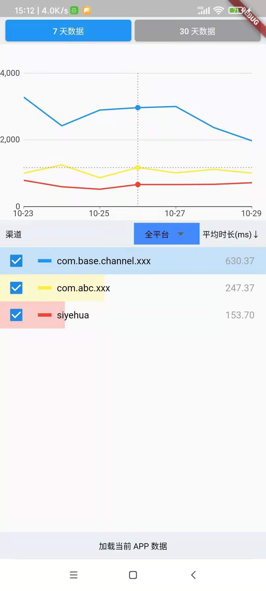

# channel_monitor

监控 platforms channel, 包括 `EventChannel`, `MethodChannel`, and `BinaryChannel`.<br>

## 接入和使用

先在 yaml 文件中引入最新版本，接着在你flutter 入口加入下面代码：

```dart
void main() {
  //add this code to first in your flutter project.
  //note: this code will replace default
  CustomFlutterBinding();
  runApp(MyApp());
}
```

接入完毕，`channel_monitor` 会自动监控

## 查看监控数据

查看数据有很多种办法，下面介绍本地化查看的两种方式：

01. 添加一个查看页面 `BasePage`:

```
class MyApp extends StatelessWidget {
  @override
  Widget build(BuildContext context) {
    //the channel profiler page
    return BasePage(ChannelDataManager.instance);
  }
}
```

02. 跳过过去就能查看到数据:




## 部署到线上查看

数据到线上，可以先将当前数据上传到你的服务器：

```dart
ChannelMonitorManager.instance
   ..dataUpload = (path) {
     //the channel profiler will save in app's private dir.
     //it will callback will the data > 10K
     //you can upload data to your service and parse it.

     File file = File(path);
     // upload content to your service
     print("channel data, file: $path \n content: ${file.readAsStringSync()}");

     //if return true, the data will be delete.
     return true;
   };
```

接着把当前项目编译成 web，就可以看到了，例子请看： [example](./example)。<br>
注意 web 平台不支持 platforms channel，所以只能看导入外部数据查看，


## 更多配置

```dart
ChannelMonitorManager.instance
   ..timeOut = 10 //set monitor time out seconds, default is 5
   ..log = true // default is false
   ..testData =
       false // use test data in Android or iOS, default is false : user your current project data
   ..addIgnoreChannelList("ignorechannle")//add ignore channel name, default is  "flutter/platform", "flutter/navigation"
   ..dataUpload = (path) {
     //the channel profiler will save in app's private dir.
     //it will callback will the data > 10K
     //you can upload data to your service and parse it.

     File file = File(path);
     // upload content to your service
     print("channel data, file: $path \n content: ${file.readAsStringSync()}");

     //if return true, the data will be delete.
     return true;
   };
```

### 如果你自定义了 `WidgetsFlutterBinding` 或 `BinaryMessenger`, 可是直接使用 `ChannelMonitorManager`.
如何使用，可以参考这里 [custom_flutter_binding](./lib/monitor/custom_flutter_binding.dart)

